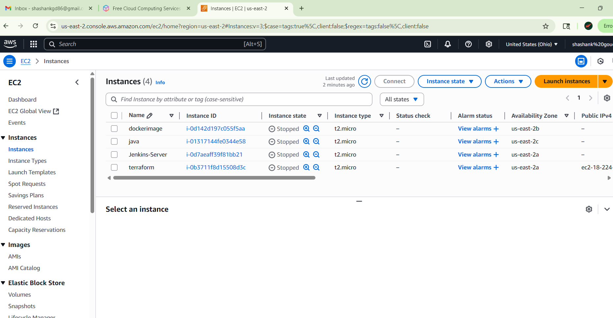

# AWS Project: Jenkins and Docker Integration on EC2

## Overview
This project demonstrates setting up a CI/CD pipeline using *AWS EC2, **Jenkins, **Terraform, and **Docker*. The pipeline automates the creation and deployment of Docker images on Linux servers.

---

## Features
- *EC2 Instances*: Configured for SSH access.
- *Jenkins Setup*: Installed Jenkins on Linux servers for CI/CD.
- *Terraform*: Installed Terraform on one instance for infrastructure as code.
- *Docker*: Installed Docker and created a custom Docker image.

---

## Screenshots
### 1. EC2 Instance Setup
This screenshot shows the EC2 instances configured for the project.

---

### 2. SSH Connection
SSH access to the Linux server for setting up Jenkins and Docker.

---

### 3. Jenkins Installed
Jenkins successfully installed and running on the Linux server.

---

### 4. Docker Image Created
A custom Docker image built using Jenkins and Docker.

---

## Tools and Technologies Used
- *AWS EC2*: Infrastructure provisioning.
- *Jenkins*: Continuous Integration/Continuous Deployment.
- *Docker*: Containerization.
- *Terraform*: Infrastructure as Code (IaC).
- *Linux*: Base environment for Jenkins and Docker setup.

---

## How to Use This Repository
1. *Explore Screenshots*: View the setup and configurations in the images/ folder.
2. *Understand the Workflow*: Read through the descriptions provided for each step.
3. *Recreate the Setup*: Follow the documented steps to replicate this project.

---

## Next Steps
- Automate image deployment using Terraform.
- Expand the CI/CD pipeline to integrate Kubernetes.

---

## Acknowledgments
This project demonstrates the synergy of cloud services and DevOps tools, showcasing practical applications of AWS, Jenkins, and Docker.

aws instances.png
